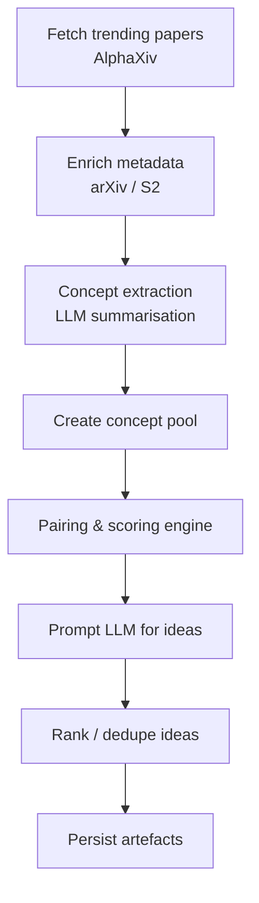

# Mix-and-Match Ideation Strategy

> Designing the *ideation* stage for the GAJ AI-Scientist

---

## 1. Purpose & Scope

The *ideation* stage is responsible for autonomously generating **high-quality, novel research ideas** by systematically combining insights from recently published scientific work with the LLM's existing world knowledge.

We focus on the *paper-mix-and-match* technique:

1. **Harvest** fresh, trending literature (AlphaXiv ➜ arXiv full-text).
2. **Extract** core concepts, methods, and findings.
3. **Pair / blend** complementary or disjoint concepts to surface unexplored intersections.
4. **Propose** concrete research questions, hypotheses, or experimental agendas via an LLM prompt.

This document defines the pipeline, data structures, heuristics, and prompting strategy—serving as the blueprint for subsequent implementation.

---

## 2. Key Requirements

• **Recency** – Prioritise papers trending in the last 7-30 days.  
• **Breadth** – Cover diverse domains to maximise serendipitous combinations.  
• **Depth** – Use abstracts (and optionally introductions/methods) to capture methodological nuance.  
• **Quality control** – Filter obvious duplicates, low-signal, or off-topic papers.  
• **Explainability** – Each idea should cite the source concepts and articulate the novelty gap.  
• **Extensibility** – Easy to swap retrieval back-ends or adjust prompting without core refactor.

---

## 3. High-Level Pipeline



### 3.1 Fetch Trending Papers (AlphaXiv)
• Endpoint: `GET /v2/papers/trending-papers` via `utils.alphaxiv.get_trending_papers`  
• Parameters: `page_size=50`, `sort_by="Hot"`, optional `custom_categories`  
• Return: list of `AlphaPaper` objects

### 3.2 Metadata Enrichment
For each `AlphaPaper`:
1. Retrieve arXiv metadata & abstract via `utils.arxiv.get_paper`.
2. Optionally query Semantic Scholar for citation counts / venue prestige (`utils.semantic_scholar.get_paper`).
3. Build a unified `PaperMeta` dataclass:
   ```python
   class PaperMeta(BaseModel):
       arxiv_id: str
       title: str
       abstract: str
       categories: list[str]
       published: datetime
       organizations: list[str]
       citation_count: int | None
   ```

### 3.3 Concept Extraction
Goal: distil each paper into **key concepts** (methods, datasets, findings).

Approach:
1. Compose prompt with the title + abstract.
2. Instruct LLM to output up to *N* bullet-point concepts (structured JSON for easy downstream use).
3. Validate JSON with Pydantic schema; retry on formatting errors.

Example concept schema:
```json
{
  "method": "Diffusion-based generative model",
  "innovation": "Uses adaptive masking for controllable generation",
  "domain": "Computer Vision",
  "keywords": ["diffusion", "masking", "image synthesis"]
}
```

### 3.4 Concept Pool & Indexing
Accumulate all extracted concepts in an in-memory list or lightweight SQLite/duckdb table.  Include paper provenance for traceability.

### 3.5 Pairing & Scoring Engine
Heuristics to select concept pairs/triples:

1. **Cross-domain pairing** – e.g., CV method × NLP dataset.
2. **Method ↔ Application** – pair a new algorithm with an unsolved real-world task.
3. **Orthogonal innovation** – combine two improvements that target different bottlenecks (e.g., efficiency + robustness).
4. **Complementary resources** – large dataset + novel model design.

Algorithm:
1. Compute semantic embeddings (OpenAI `text-embedding-3-small`) for each concept.
2. Use cosine similarity thresholds to avoid near-duplicates.
3. Sample *K* diverse pairs using Maximal Marginal Relevance (MMR).
4. Score pairs with heuristic function `score = novelty_weight * cross_domain + recency_weight * avg_age + paper_hotness`.
5. Keep top *M* pairs.

### 3.6 Ideation Prompting
Construct a **single chat prompt** containing:

• System role – "You are an expert research ideation assistant …"  
• Few-shot exemplars – 2-3 examples of concept pairs ⇒ idea output.  
• Current date for temporal grounding.  
• A list (JSON array) of selected concept pairs with metadata (titles, abstracts).

Ask the LLM to produce for *each pair*:
1. Working title of the potential paper.
2. One-sentence hypothesis/research question.
3. Brief methodology outline (2-3 bullets).
4. Expected contributions & impact.
5. Required resources/datasets.

Return structured JSON list validated via `pydantic`.

### 3.7 Ranking & De-duplication
Post-process ideas:
• Score via length, specificity, and diversity of domains.  
• Deduplicate by title similarity (Levenshtein distance < 0.2).  
• Optionally re-rank with a short LLM scoring pass.

### 3.8 Persistence & Hand-off
Save to `ideation/outputs/{date}.jsonl` with:
```json
{"idea_id": "uuid4", "idea": {…}, "source_pairs": [<arxiv_ids>], "created_at": "…"}
```
This artefact seeds the *planning* stage.

---

## 4. Error Handling & Resilience
• **Rate-limits** – leverage built-in rate-limiter in utils modules; exponential back-off on 429s.  
• **Partial failures** – skip papers that fail enrichment rather than aborting the batch.  
• **LLM formatting issues** – use structured output with `instructor` to guarantee JSON compliance.

---

## 5. Configurability
| Parameter | Env var / default | Description |
|-----------|-------------------|-------------|
| `TRENDING_PAGE_SIZE` | `50` | Number of papers fetched per run |
| `CONCEPTS_PER_PAPER` | `5` | Max concepts extracted |
| `PAIR_TOP_K` | `100` | Candidate pairs before scoring |
| `IDEAS_TO_RETURN` | `30` | Final ideas per run |

Expose these via `mix_and_match_strategy.py` constants or CLI flags.

---

## 6. Future Extensions
1. **Full-text PDF parsing** – enrich concepts with figures/tables.  
2. **Knowledge graph integration** – link new concepts to existing literature graph for smarter pairing.  
3. **Active feedback loop** – incorporate user rating of generated ideas to fine-tune scoring heuristics.

---

## 7. Milestone Breakdown
1. *MVP* – implement pipeline with abstracts-only extraction & simple random pairing.  
2. *Quality pass* – embeddings, MMR selection, structured prompts.  
3. *Analytics* – dashboards on idea novelty vs. citation overlap.  
4. *UX integration* – surface ideas in a web UI for human-in-the-loop triage.

---

*Authored on:* {{date}} 